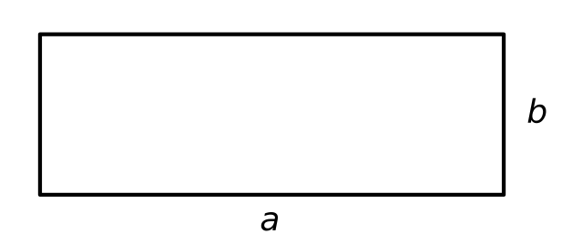
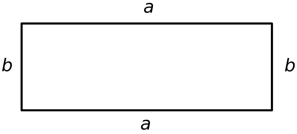
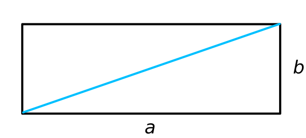
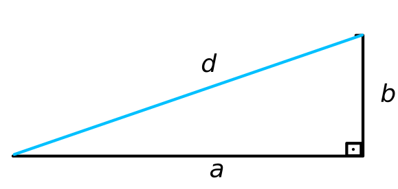

# Polygon Area Calculator

## Instruções
---
Neste projeto, você usará programação orientada a objetos para criar uma classe Rectangle e uma classe Square. A classe Square deve ser uma subclasse de Rectangle e herdar métodos e atributos.

#### classe retângulo

Quando um objeto Rectangle é criado, ele deve ser inicializado com os atributos `width` e `height`. A classe também deve conter os seguintes métodos:

- `set_width`
- `set_height`
- `get_area`: Área de retorno ( `width * height`)
- `get_perimeter`: Retorna o perímetro ( `2 * width + 2 * height`)
- `get_diagonal`: Retorna diagonal ( `(width ** 2 + height ** 2) ** .5)`
- `get_picture`: Retorna uma string que representa a forma usando linhas de "*". O número de linhas deve ser igual à altura e o número de "*" em cada linha deve ser igual à largura. Deve haver uma nova linha (`\n`) no final de cada linha. Se a largura ou altura for maior que 50, isso deve retornar a string: **"Too big for picture."**
- `get_amount_inside`: Toma outra forma (quadrado ou retângulo) como argumento. Retorna o número de vezes que a forma passada poderia caber dentro da forma (sem rotações). Por exemplo, um retângulo com largura 4 e altura 8 caberia em dois quadrados de lado 4.

Além disso, se uma instância de Rectangle for representada como uma string, ela deverá se parecer com: `Rectangle(width=5, height=10)`

#### classe quadrada

A classe Square deve ser uma subclasse de Rectangle. Quando um objeto Square é criado, um único comprimento lateral é passado. O `__init__` método deve armazenar o comprimento lateral nos atributos `width` e `height` da classe Rectangle.

A classe Square deve ser capaz de acessar os métodos da classe Rectangle, mas também deve conter um `set_side` método. Se uma instância de um Square for representada como uma string, ela deve se parecer com: `Square(side=9)`

Além disso, os métodos `set_width` e `set_height` na classe Square devem definir a largura e a altura.

#### Exemplo de uso

~~~Python 
rect = shape_calculator.Rectangle(10, 5)
print(rect.get_area())
# Return: 50

rect.set_height(3)
print(rect.get_perimeter())
# Return: 26

print(rect)
# Return: Rectangle(width=10, height=3)

print(rect.get_picture())
# Return: 

# **********
# **********
# **********

sq = shape_calculator.Square(9)
print(sq.get_area())
# Return: 81

sq.set_side(4)
print(sq.get_diagonal())
# Return: 5.656854249492381

print(sq)
# Return: Square(side=4)

print(sq.get_picture())

# Return:
# ****
# ****
# ****
# ****

rect.set_height(8)
rect.set_width(16)
print(rect.get_amount_inside(sq))
# Return: 8
~~~

# Solução 
---
As intruções são bem claras e para este projeto não necessitaremos de muita coisa além delas. Começaremos criando a classe Rectangle e seus métodos

## Criação da Classe Rectangle

De cara, criaremos a classe e ao inicializá-la, vamos atribuir duas variáveis de classe. Faremos isso, por meio do método especial __init__.

~~~Python
class Rectangle:
    # Especial Methods
    def __init__(self,width, height):
        self.width = width
        self.height = height
~~~

Além disso, se imprimirmos o objeto retangulo deveremos retornar uma string que diga sua largura e altura. Faremos isso modificando o método especial __str__. 

~~~Python
    def __str__(self):
        obj = f"Rectangle(width={self.width}, height={self.height})"
        return obj
~~~

### Métodos set_width e set_height.

Para esses métodos o que precisamos basicamente é ter como entrada uma nova largura ou uma nova altura para nosso retangulo e fazer essa largura ou altura sobrescrever a que fora inicializada junto à classe. Assim, 
~~~Python
    def set_width(self, new_width):
        self.width = new_width

    def set_height(self, new_height):
        self.height = new_height

~~~
### Métodos get_area, get_perimeter e get_diagonal. 

Sabemos que para calcular a àrea de um retangulo basta multiplicar sua base pela altura. O perímetro por sua vez é a soma de todos os lados e a diagonal obtemos utilizando o teorema de Pitágoras. Assim, fixemos a largura e a altura de um retangulo por $a$ e $b$, respectivamente. Como representamos abaixo,

Daí, a área do retangulo será o produto $a\cdot b$. Por meio disso, criamos a função _get_area()_ abaixo

~~~Python
    def get_area(self):
        return self.width * self.height
~~~

O perímetro nada mais é que a soma da medida de todos os lados. Como a figura é um retangulo, então os lados opostos tem a mesma medida.

Chamando o perímetro de $P$, temos

$$
P = a + b + a + b = 2a+ 2b = 2(a+b) 
$$

Traduzindo isso em código, temos

~~~Python
    def get_perimeter(self):
        return 2*(self.width + self.height)
~~~

   Agora vamos calcular a diagonal. Bom, sabemos que um retangulo é um polígono e a diagonal de um polígono é um segmento que liga dois vértices não adjacentes. A reta azul na figura abaixo, por exemplo, é uma diagonal do nosso retângulo.

Por definição de retângulo, todos os ângulos são congruentes, isto é, medem 90 graus cada. Logo, podemos destacar o triângulo formado pelo segmento da altura, o segmento do comprimento e a diagonal e ficamos com a figura abaixo

Desta forma, temos um triângulo retângulo. Logo, vale o teorema de Pitágoras que diz:

 
    <i>
        Em um triângulo retângulo, o quadrado do maior lado é igual a soma dos quadrados dos outros dois. 
    </i>

Assim, temos:

$$
d^2 = a^2 + b^2 \Rightarrow \sqrt{d^2} = \sqrt{a^2 + b^2} \Rightarrow d = \sqrt{a^2 + b^2}
$$

Pondo isso para o python, temos
~~~Python
    def get_diagonal(self):
        return ((self.width)**2 + (self.height)**2)**0.5

~~~

### Métodos get_picture e get_amount_inside

Para o primeiro método, precisamos desenhar, por meio de asteríscos, a figura com as dimensões atribuídas a ela. Uma ressalva é que se a largura for maior que 50, então teremos um erro. Caso não seja, vamos definir uma variável _line_ que será formada por " * " conforme a lagura. Ou seja, se a largura for 5, teremos `line = *****`.
Em seguida, definiremos uma string vazia chamada de _rec_picture_ e adicionaremos à ela a variável _line_ a quantidade de vezes dada na altura do retangulo. Em termos de código, temos 

~~~Python
    def get_picture(self):
        if self.width > 50:
            return "Too big for picture."
        else:
            line = self.width * '*'
            rec_picture = ''
            for i in range(self.height):
                rec_picture += line+'\n'
            return rec_picture
~~~

Para o outro método, vamos ter como entrada uma figura. Queremos saber basicamente quantas vezes a figura que foi passada como argumento cabe no retangulo que definimos na classe. Então faremos uma divisão da àrea do retangulo atual com o do retangulo que estamos passando como argumento. Claramente, queremos só a parte inteira. Assim, definiremos uma variável _current_shape_area_ que receberá a área do retangulo atual. Outra chamada _argument_shape_area_ que receberá a área do retangulo que estamos pondo como argumento e retornaremos a parte inteira da divisão `current_shape_area / argument_shape_area` como segue:

~~~Python
    def get_amount_inside(self, shape):
        current_shape_area = self.get_area()
        argument_shape_area = shape.get_area()
        number_times = int(current_shape_area / argument_shape_area)

        return number_times
~~~

## Classe Square

Utilizaremos o conceito de herança para criar essa clase. A priori, pegaremos o método construtor e modificaremos apenas os argumentos de forma que tenhamos apenas o argumento _side_.

~~~Python
class Square(Rectangle):
    def __init__(self, side):
        super().__init__(side,side)

~~~

O objeto quadrado quando for impresso deve dizer apenas o lado. Assim,
~~~Python
    def __str__(self):
        return f"Square(side={self.width})"
~~~
Por fim, o método _set_side_ é dado da seguinte forma:

~~~Python
    def set_side(self, new_side):
        self.width = new_side
        self.height = new_side
~~~
E assim, concluímos o projeto.

# Código Completo

~~~Python
class Rectangle:
    # Especial Methods
    def __init__(self,width, height):
        self.width = width
        self.height = height
    def __str__(self):
        obj = f"Rectangle(width={self.width}, height={self.height})"
        return obj
        
    # Class Methods

    def set_width(self, new_width):
        self.width = new_width

    def set_height(self, new_height):
        self.height = new_height

    def get_area(self):
        return self.width * self.height
    
    def get_perimeter(self):
        return 2*(self.width + self.height)
    
    def get_diagonal(self):
        return ((self.width)**2 + (self.height)**2)**0.5
    
    def get_picture(self):
        if self.width > 50:
            return "Too big for picture."
        else:
            line = self.width * '*'
            rec_picture = ''
            for i in range(self.height):
                rec_picture += line+'\n'
            return rec_picture

    def get_amount_inside(self, shape):
        current_shape_area = self.get_area()
        argument_shape_area = shape.get_area()
        number_times = int(current_shape_area / argument_shape_area)

        return number_times

class Square(Rectangle):
    def __init__(self, side):
        super().__init__(side,side)

    def __str__(self):
        return f"Square(side={self.width})"

    def set_side(self, new_side):
        self.width = new_side
        self.height = new_side

~~~
